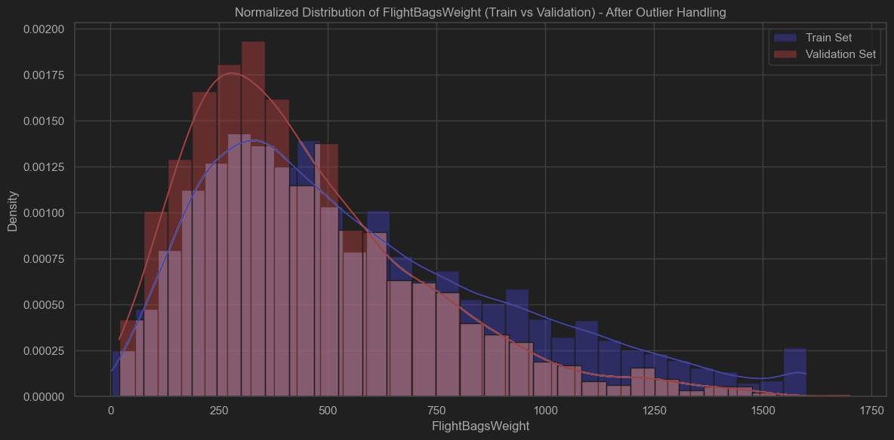
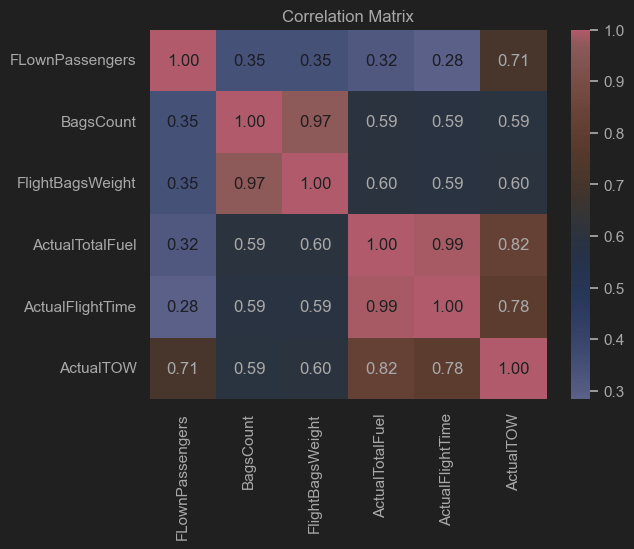
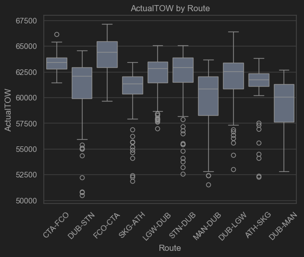
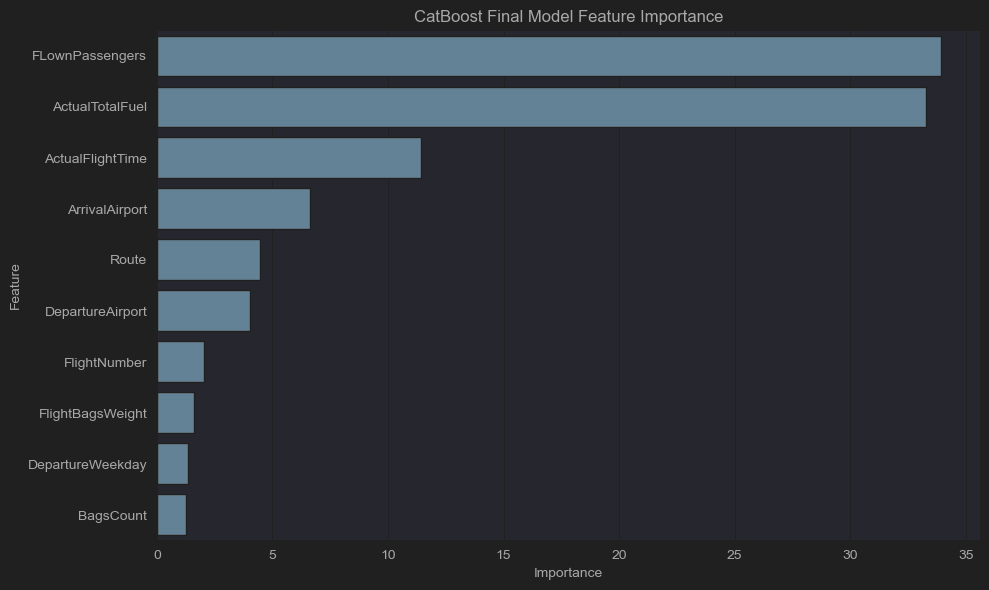

# Ryanair Take-Off Weight Regression: EDA and Modeling Report

## 1. Exploratory Data Analysis (EDA)

### Data Overview
- **Datasets:**  
  - Training data: `data/training.csv`  
  - Validation data: `data/validation.csv`
- **Features:**
  - Date Features: `DepartureDate`, `DepartureYear`, `DepartureMonth`, `DepartureDay`
    - due to the short time span of the dataset, these features were not used in modeling. Instead created `DepartureWeekday`
  - Categorical Features: `DepartureAirport`, `ArrivalAirport`, `Route`, `FlightNumber`, `DepartureWeekday`'
  - Numeric Features: `ActualTotalFuel`, `ActualFlightTime`, `FLownPassengers`, `BagsCount`, `FlightBagsWeight`
- **Target Variable:**  
  - Take-Off Weight (TOW)

### Data Inspection
- **Shape:**  
  - Training set: (29731 rows, 14 features)  
  - Validation set: (1878 rows, 13 features)
- **Preview:**  
  - Displayed the first few rows to understand feature types and distributions.

### Missing Values
- **Analysis:**  
  - Identified missing values in features: `ActualTOW`, `FLownPassengers`, `BagsCount`, `FlightBagsWeight`
- **Handling:**  
  - `ActualTOW` - Dropped rows with missing values. Since it is the target variable, missing values cannot be imputed in the training set.
  - `FlownPassengers` - Dropped rows with missing values. Every training row that had a missing value in this feature also had a missing value in `BagsCount` and `FlightBagsWeight`. 
    - In the validation set, imputed using median of the training set to avoid dropping of rows.
  - `BagsCount` - Imputed missing values with the median of the training set.
  - `FlightBagsWeight` - Imputed missing values with the value of `BagsCount` multiplied by the average weight of a bag (calculated on the training set data).

### Numeric Data Analysis and Outlier Detection

- **Method:**  
  - Visualized distributions using histograms.
  - Detected outliers in features such as `BagsCount`, `ActualFlightTime`, `FlightBagsWeight`.
- **Handling:**  
  - Decided to cap outliers at the 1st and 99th percentiles based on the training set.
  - Applied capping to both training and validation sets to maintain consistency.

### Feature Distributions
- **Visualizations:**  
  - Plotted histograms for all numeric features.
  - Compared distributions between training and validation sets to check for data drift.

### Correlation Analysis

- **Correlation Matrix:**  
  - Computed and visualized correlations between features and the target.
  - Identified top features most correlated with TOW.

### Categorical Features

- **Analysis:**  
  - Counted unique values in categorical features, checked for rare categories and planned encoding strategies. The chosen encoding method was LabelEncoder for models that support categorical features. For linear models only numerical features were used.
  - There are no inconsistent routes or flight numbers in the training set, so no additional cleaning was needed.

### Summary of EDA Findings
- The data contains various features with varying degrees of missingness and outliers.
- Several features show strong correlation with the target (`ActualTotalFuel`, `FLownPassengers`, `ActualFlightTime`).
- No major data drift detected between training and validation sets.
- Outlier capping and imputation are necessary preprocessing steps.

## 2. Modeling and Predictions

- **Algorithms evaluated:**
  - Linear Regression
  - Ridge Regression
  - Lasso Regression
  - Bayesian Ridge Regression
  - Random Forest Regressor
  - XGBoost Regressor
  - CatBoost Regressor
  - Bayesian Regression (PyMC MCMC)

- **Evaluation Metric:**  
  Root Mean Squared Error (RMSE) on a hold-out test set and via 5-fold cross-validation.

### Preprocessing and Feature Encoding

- Data was cleaned and preprocessed using the `preprocess_train_val` function.
- **Categorical features** (`DepartureAirport`, `ArrivalAirport`, `Route`, `FlightNumber`, `DepartureWeekday`) were encoded using `LabelEncoder` for tree-based models (Random Forest, XGBoost, CatBoost).
- For linear models, only numerical features were used to avoid introducing spurious ordinal relationships.

### Model Training and Results

| Model                           | RMSE   |
|----------------------------------|--------|
| Linear Regression                | 966.71 |
| Ridge Regression                 | 966.71 |
| Lasso Regression                 | 966.71 |
| Bayesian Ridge                   | 966.71 |
| Random Forest                    | 859.78 |
| XGBoost                          | 763.06 |
| CatBoost                         | 732.19 |
| Bayesian Regression (PyMC MCMC)  | 966.28 |

- **Tree-based models** outperformed linear models, with CatBoost achieving the lowest RMSE.
- **CatBoost** natively handled categorical variables and showed strong reliance on the `FLownPassengers` feature.
- Features with higher missingness (e.g., `BagsCount`, `FlightBagsWeight`) contributed less to model predictions.
- All linear models (`Linear`, `Ridge`, `Lasso`, `Bayesian Ridge`) performed identically, suggesting they captured similar patterns — and likely struggled with the non-linearity or complexity in the data.

### Cross-Validation

- 5-fold cross-validation confirmed CatBoost’s superior performance:
  - **CatBoost:** Mean RMSE = 755.77 ± 48.04
  - **XGBoost:** Mean RMSE = 783.99 ± 54.48

### Hyperparameter Tuning and Final Model

- Performed randomized search for CatBoost hyperparameters.
- Trained the final CatBoost model on the full training data with the best parameters.
- Saved the trained model for future inference.
- The final Catboost model performed the cross-validation with CV RMSE: 742.3864548858098. Showing the hyperparameter tuning improved the model's performance.

### Results
- **Training Data Performance:**  RMSE = 742.39
- **Feature Importance:**

| Rank | Feature            | Importance   |
|------|--------------------|-------------|
| 1    | FLownPassengers    | 33.92       |
| 2    | ActualTotalFuel    | 33.29       |
| 3    | ActualFlightTime   | 11.44       |
| 4    | ArrivalAirport     | 6.63        |
| 5    | Route              | 4.48        |
| 6    | DepartureAirport   | 4.02        |
| 7    | FlightNumber       | 2.04        |
| 8    | FlightBagsWeight   | 1.58        |
| 9    | DepartureWeekday   | 1.33        |
| 10   | BagsCount          | 1.27        |

### Predictions
- **Validation Set Predictions:**
  - final code ran to generate predictions can be found in `main.py`
  - Used the final CatBoost model, tuned in `notebooks/02_modelling.ipynb` to predict TOW on the validation set.
- **Output:**  
  - Saved predictions for the validation set to `predictions.csv`

### Conclusions from Modeling

- CatBoost is the most suitable model for this regression task, providing strong predictive accuracy and robust generalization.
- The key features influencing TOW are `FLownPassengers`, `ActualTotalFuel`, and `ActualFlightTime`.

### Potential Improvements
- To enhance the quality of predictions we could implement additional features such as:
  -Weather conditions
  -Distance between airports - strictly related to the route and amount of fuel needed.
- Further hyperparameter tuning and model ensembling could improve performance.
- Exploring additional models like LightGBM or deep learning approaches could yield further insights.
- Better handling of missing values and outliers (imputation basing on model).
- Better handling of categorical features, possibly using target encoding or frequency encoding for bayesian or linear models.